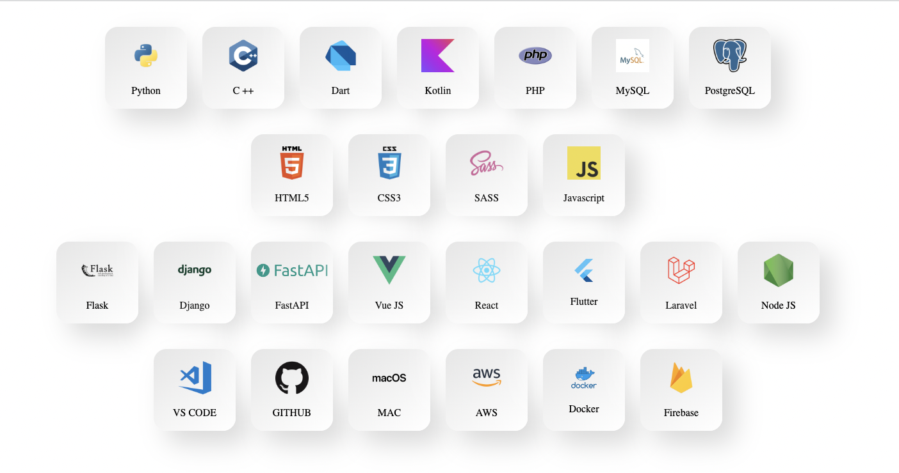

### Hi there, I'm Yubaraj 👋

## I'm a Programmer, Designer, Traveller and Gamer!
- 🔭 I’m working on various projects 😂
- 🌱 Just started to contribute on open source projects 
- ⚡ Fun fact: I love to draw and currently practicing guitar

---

### Connect with me:

[][website]
[][youtube]
[][twitter]
[][linkedin]
[][instagram]

  

### Languages and Tools:

### StackOverflow Activity
<!-- STACKOVERFLOW:START -->
- [Authentication in Iframe APi Jitsi](https://stackoverflow.com/questions/62578288/authentication-in-iframe-api-jitsi)
- [Answer by Yubaraj Shrestha for Why html loaded to another html file with jquery does not appear correctly?](https://stackoverflow.com/questions/59340437/why-html-loaded-to-another-html-file-with-jquery-does-not-appear-correctly/59341976#59341976)
- [I am unable to publish app in play store, any ideas?](https://stackoverflow.com/questions/56032512/i-am-unable-to-publish-app-in-play-store-any-ideas)
- [Answer by Yubaraj Shrestha for Android percent screen width in RecyclerView item](https://stackoverflow.com/questions/51201482/android-percent-screen-width-in-recyclerview-item/51387079#51387079)
- [Answer by Yubaraj Shrestha for Last inserted id Inside transaction with Lumen/Laravel](https://stackoverflow.com/questions/51380219/last-inserted-id-inside-transaction-with-lumen-laravel/51382453#51382453)
<!-- STACKOVERFLOW:END -->

### 📺 Latest YouTube Videos
<!-- YOUTUBE:START -->
- [Roles and Permissions in Masonite](https://www.youtube.com/watch?v=zX0YKxy9cuQ)
- [Masonite Application Deployment using Docker](https://www.youtube.com/watch?v=YYlo3qf5fCY)
- [Model Attributes - Masonite Tutorial](https://www.youtube.com/watch?v=I8SJY6mo6bM)
- [Frontend Vue and Tailwind Setup - Masonite Tutorial](https://www.youtube.com/watch?v=rEW_-drDEBU)
- [API Data Validation - Masonite Tutorial](https://www.youtube.com/watch?v=1e2jEDgfZR4)
<!-- YOUTUBE:END -->

---

### 📕 Latest Tutorial
<!-- BLOG-POST-LIST:START -->
- [Web Scraping in Python](https://yubarajshrestha.com.np/tutorials/web-scraping-in-python)
<!-- BLOG-POST-LIST:END -->

---

 

[website]: https://yubarajshrestha.com.np
[twitter]: https://twitter.com/meyubaraj
[youtube]: https://youtube.com/YubarajShrestha_YS
[instagram]: https://instagram.com/meyubaraj
[linkedin]: https://linkedin.com/in/meyubaraj
